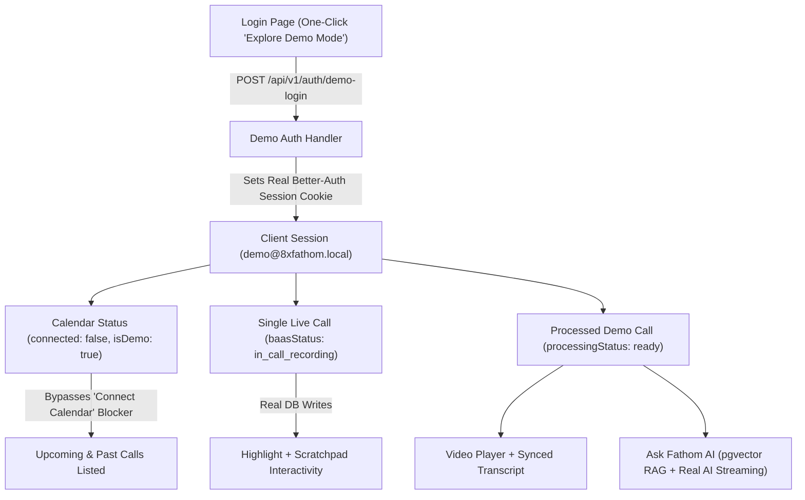

# Session Log - 2026-09-26

Session: `ee83cddf` | Project: `8x-fathom` | Author: `IamAyaanSk`

---

[LOG_ENTRY type=PROMPT num=1 session=ee83cddf]
timestamp: 2026-09-26T10:37:18Z
model: gemini-3.7-flash-high

Hey, I am planning to make a dummy user which cannot connect calendar, have demo calls listed, demo record, a single live call with status as recording so uder can explore the highlight and scratchpad feature.
Demo processed calls to access the summary and use fathom ai. Plot how can we do it properly. I have some ways in my mind but whats your take on this, how will you do this?

[LOG_ENTRY type=RESPONSE num=1 session=ee83cddf]
timestamp: 2026-09-26T10:45:57Z
model: gemini-3.7-flash-high

Here is an architectural plan and recommended implementation strategy for introducing a **Dummy / Demo User**.

---

### Core Philosophy: First-Class Database Citizen, Zero UI Hacks

Rather than building brittle mock layers in client-side interceptors or mock state machines, **treat the Demo User as a real user in PostgreSQL**:
- Real Better-Auth session cookie
- Real PostgreSQL records (`User`, `Meeting`, `TranscriptChunk`, `ActionItem`, `Highlight`, `ScratchpadEntry`)
- Real pgvector embeddings for actual semantic search in **Ask Fathom**
- Real video playback & synced transcript

This guarantees **100% of your production stack executes naturally**: TanStack Query hooks, Express controllers, `requireSession` middleware, and streaming Vercel AI SDK agents.

---

### Architecture & Implementation Plan

---

### Pillar 1: One-Click Demo Auth & Session

1. **Frontend entry point**:
   - On [LoginPage](file:///Users/ayaan/Documents/Projects/8x-fathom/apps/web/src/components/auth/login-page.tsx), add a divider and an **"Explore as Demo User"** or **"Try Interactive Demo"** button below "Continue with Google".
2. **Server endpoint (`POST /api/v1/auth/demo-login`)**:
   - Upserts a deterministic demo user in PostgreSQL (`id: 'demo-user-id'`, `email: 'demo@8xfathom.local'`, `name: 'Demo User'`).
   - Creates a valid Better-Auth `Session` record in the database.
   - Sets the standard `better-auth.session_token` HTTP cookie on the response.
3. **Outcome**:
   - TanStack Router's `beforeLoad` on `_authenticated.tsx` and [requireSession](file:///Users/ayaan/Documents/Projects/8x-fathom/apps/server/src/v1/middlewares/require-session.ts) treat the demo user as a genuine authenticated user.

---

### Pillar 2: "Cannot Connect Calendar" & UI Gating

Currently, [upcoming-calls-page.tsx](file:///Users/ayaan/Documents/Projects/8x-fathom/apps/web/src/components/pages/upcoming-calls-page.tsx) displays a blocking **"Connect your calendar"** full-screen banner if `!connected`, and both [my-calls-page.tsx](file:///Users/ayaan/Documents/Projects/8x-fathom/apps/web/src/components/pages/my-calls-page.tsx) and [live-calls-page.tsx](file:///Users/ayaan/Documents/Projects/8x-fathom/apps/web/src/components/pages/live-calls-page.tsx) disable meeting queries (`enabled: connected === true`).

To satisfy *"cannot connect calendar"* while still displaying demo calls:

1. **Contract & Controller update**:
   - In [getCalendarStatusController](file:///Users/ayaan/Documents/Projects/8x-fathom/apps/server/src/v1/controllers/calendar.ts), return `{ connected: false, isDemo: true }` when `userId === 'demo-user-id'`.
2. **Frontend gating adaptation**:
   - In [upcoming-calls-page.tsx](file:///Users/ayaan/Documents/Projects/8x-fathom/apps/web/src/components/pages/upcoming-calls-page.tsx):
     - If `isDemo`, bypass the blocking "Connect your calendar" overlay and render the upcoming meeting list.
     - Show a subtle informational banner: *"Demo Mode: Showing simulated calendar calls. Google Calendar connection is disabled."*
     - Replace the "Connect Calendar" action with a disabled state or tooltip.
   - In [my-calls-page.tsx](file:///Users/ayaan/Documents/Projects/8x-fathom/apps/web/src/components/pages/my-calls-page.tsx) and [live-calls-page.tsx](file:///Users/ayaan/Documents/Projects/8x-fathom/apps/web/src/components/pages/live-calls-page.tsx):
     - Update queries to `enabled: connected === true || isDemo === true`.
3. **Safety guard in [postCalendarSyncController](file:///Users/ayaan/Documents/Projects/8x-fathom/apps/server/src/v1/controllers/calendar.ts)**:
   - If `userId === 'demo-user-id'`, immediately return `{ success: true, message: 'Demo calendar refreshed', data: { syncedCount: 0, lastSyncedAt: ... } }` to avoid throwing errors about missing Google tokens.

---

### Pillar 3: Live Call Playground (Highlight & Scratchpad)

1. **Database row**:
   - Title: `"⚡ Engineering Sprint & Architecture Sync"`
   - `baasStatus: 'in_call_recording'`
   - `processingStatus: 'idle'`
   - **`baasBotId: null`** (Crucial: [reconcile-bot-status](file:///Users/ayaan/Documents/Projects/8x-fathom/apps/worker/src/reconcile-bot-status/index.ts) only polls meetings with `baasBotId: { not: null }`, so the worker will never interfere or mark it failed).
2. **Dynamic time anchoring**:
   - If timestamps are static, the call will appear to have ended after 30 minutes.
   - When the demo user logs in (or in a lightweight hook), dynamically anchor:
     - `recordingStartedAt = now - 3 minutes`
     - `endTime = now + 25 minutes`
   - This ensures the recording counter (`03:12... 03:13`) is actively ticking every time a user visits.
3. **Interactive testing**:
   - Navigating to `/meetings/live` shows the active recording row.
   - Clicking it opens [MeetingLivePage](file:///Users/ayaan/Documents/Projects/8x-fathom/apps/web/src/components/meetings/meeting-live-page.tsx).
   - [postMeetingHighlightController](file:///Users/ayaan/Documents/Projects/8x-fathom/apps/server/src/v1/controllers/meeting/highlights.ts) and [putMeetingScratchpadEntryController](file:///Users/ayaan/Documents/Projects/8x-fathom/apps/server/src/v1/controllers/meeting/scratchpad.ts) already work seamlessly! The visitor can type scratchpad notes and click "Highlight" to see them persist to PostgreSQL and update live.

---

### Pillar 4: Processed Demo Calls (Video, Synced Transcript, Summary)

1. **Seed 1–2 high-quality processed calls**:
   - Title: `"Product Strategy & Q4 Roadmap Alignment"`
   - `baasStatus: 'completed'`, `processingStatus: 'ready'`
   - Markdown `summary` with structured sections: Overview, Decisions, Action Items.
   - Pre-populated `ActionItem`, `Highlight`, `ScratchpadEntry`, and `MeetingParticipant` rows.
2. **Video playback**:
   - In [getMeetingPlaybackUrl](file:///Users/ayaan/Documents/Projects/8x-fathom/apps/server/src/services/meeting/index.ts), allow `recordingR2Key` to be a direct HTTP/HTTPS URL (or a dedicated object in your R2 bucket like `demo/roadmap-sync.mp4`). If it starts with `http`, return it without presigning.
3. **Synced transcript**:
   - Store a standard MeetingBaas/Deepgram transcript JSON artifact in R2 (`demo/transcript.json`) matching the video timestamps.
   - [getMeetingTranscriptController](file:///Users/ayaan/Documents/Projects/8x-fathom/apps/server/src/v1/controllers/meeting/playback.ts) will parse it via [getMeetingTranscriptData](file:///Users/ayaan/Documents/Projects/8x-fathom/packages/shared-utils/src/meeting.ts#L187), driving the video-synced auto-scrolling transcript.

---

### Pillar 5: Fathom AI (Ask Fathom / RAG Chatbot)

1. **pgvector embeddings**:
   - [postMeetingAssistantController](file:///Users/ayaan/Documents/Projects/8x-fathom/apps/server/src/v1/controllers/meeting/assistant.ts) executes semantic similarity queries against `TranscriptChunk` (`ORDER BY tc.embedding <=> ...`).
2. **Seeding real vectors**:
   - During seed setup, break the transcript into chunks and pass them through [generateEmbeddings](file:///Users/ayaan/Documents/Projects/8x-fathom/packages/ai/src/embeddings.ts).
   - Insert the resulting 1024-dimension vectors into PostgreSQL using `$executeRawUnsafe`.
   - Set `transcriptEmbeddingsExtractedAt = new Date()`.
3. **Result**:
   - When a demo user opens the **"Ask Fathom"** panel and asks questions like *"What was decided about the launch timeline?"* or *"Summarize the action items for Elena"*, it will perform real vector search over the demo chunks and stream responses via the Vercel AI SDK.

---

### Pillar 6: Idempotent Seeding & Resetting

- Create a dedicated script (`packages/database/src/seed-demo.ts`, runnable with `pnpm db:seed:demo`).
- Auto-reset or dynamic refresh on login: each time a user clicks "Explore as Demo User", clear any ad-hoc scratchpad/highlights created during previous test sessions and reset `recordingStartedAt` to `now - 3m` so every tester gets a pristine sandbox.

---

### Questions & Next Steps

1. Would you like me to start by writing the **seeding script** (`packages/database/src/seed-demo.ts`) with realistic meeting data, or do you prefer to wire up the **Demo login endpoint & button** first?
2. Do you have a specific video URL/MP4 in mind for the demo recording playback, or should we host a sample meeting video in your existing R2 bucket?

